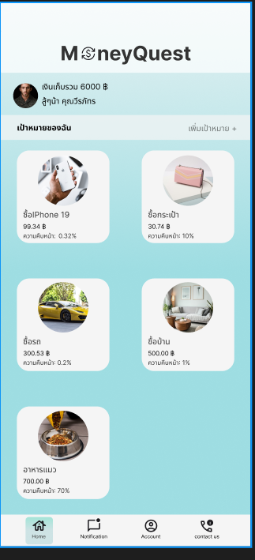
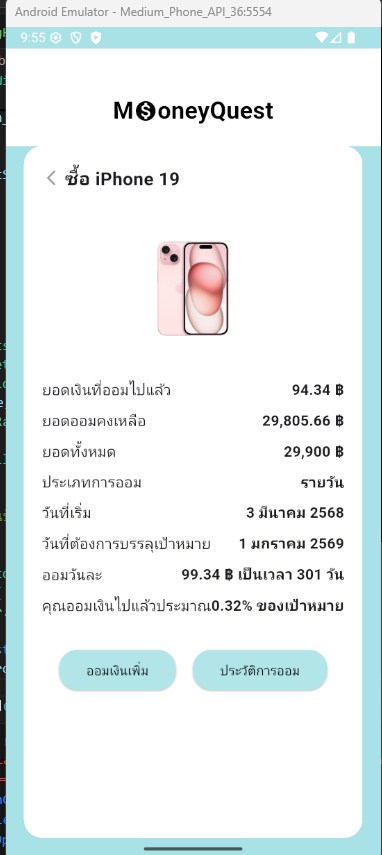
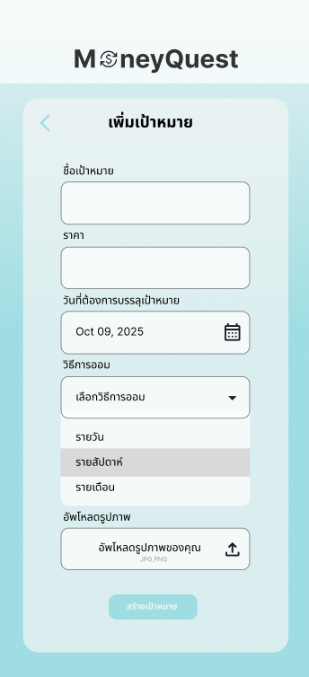

# 💰 SaveMoney - Flutter Application

A modern **Flutter mobile app** to help you **manage your savings goals** easily and stay motivated toward financial success.  
Designed with a clean UI, progress tracking, and simple goal management features.  

---

## Features
-  Create and manage multiple saving goals (e.g., Buy iPhone, Travel, Emergency Fund).  
-  Track progress with percentage and visual indicators.  
-  Get notified when you reach milestones.  
-  Beautiful and responsive Flutter UI.  
-  Data stored securely on device (extendable to Firebase/MySQL).  

---

## New Function
- Added **Goal Detail Screen**: tap on any goal to view full details and history.  
- Support for **progress updates** with smooth animation.  
- UI improvements with pastel theme colors.  

---

## Screenshots
 

| Home Screen | Goal Detail | Add New Goal |
|-------------|-------------|--------------|
|  |  |  |

---

👨‍💻 Author
Developed by Your Name
💌 Contact: weerapat17827@gmail.com
🌐 Portfolio: [weerapatserver.site](https://weerapatserver.site)

